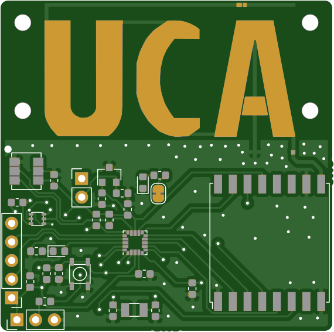
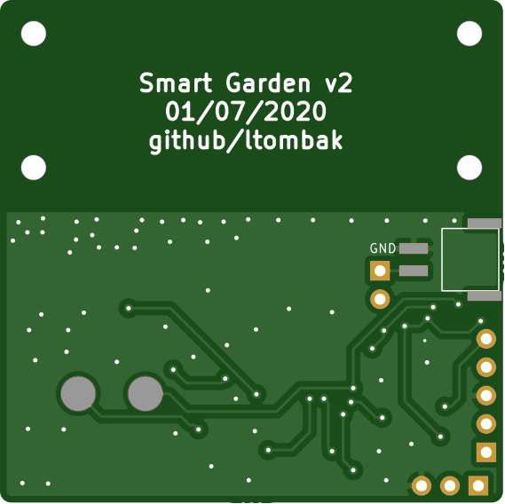

# Smart-Garden-V2
> A low-power sensor for agriculture, connected via LoRaWAN.

## Description
This project is a second iteration of LoRa sensor for agriculture. The previous version used an Arduino Pro mini as controller and some common sensors for soil moisture, temperature and humidity data.

The goal of this V2 is to lower the cost of a node with a more professional approach and also lower the power consumption for an extended battery life.

The node will be able to measure 4 data:
- Soil moisture
- Ambient Temperature
- Ambient Humidity
- Luminosity levels

## Hardware
To achieve low-cost and low-power, the mcu is an STM32L011F4U6 (~0.7$/30pcs) and the sensors are the followings:
  - AHT10 for Temperature & Humidity (~0.5$/30pcs)
  - VEML6030 as ambient light sensor (~0.45$/30pcs)
  - Voltage divider for soil moisture sensor

Then, for power I use the MCP181X which is a really good LDO and for the LoRa transceiver a RFM95W (to simplify the design and the assembly).
For the LoRa antenna I use the "UCA Antenna" provided by F. Ferrero (https://github.com/FabienFerrero/).

All the datasheets of the components are in this repository.

## PCB design
The schematic and the layout are done using KiCAD.
Here is a visualization of the PCB:

  
  

